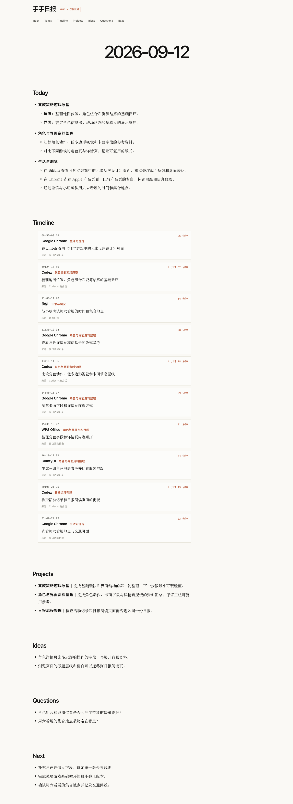

# 手手 Daily

一个本地优先的个人活动日报：读取前台应用与窗口标题、定时截图、Codex / Claude Code 本地会话，再把原始材料加工成一页简洁的日报。

[查看 Demo](docs/index.html) · [查看完整日报示例](docs/2026-09-12.html)

## 它记录什么

日报只展示能从本地证据支持的内容：

- 浏览器、Bilibili、微信等应用：前台应用和窗口标题；窗口标题看不清时只记应用级活动。
- 微信消息：只在截图确实能识别时写入，并标记为“截图识别”；不会读取聊天数据库或私聊正文。
- Codex / Claude Code：读取本机已经存在的会话元数据，用于整理项目、动作和会话时段；日报生成模型默认使用 gpt-5.6-luna，不会调用 Claude 生成日报。
- 绘画或图像工作：沿用本地 AI 会话记录与截图证据；没有可核验信息就不写。
- 总活动时长：只显示“采样估算”，不冒充精确工时。

## 日报结构

每一天只保留：

Today · Timeline · Projects · Ideas · Questions · Next

Timeline 的每条记录都包含：

时间 · 应用 · 项目 · 动作 · 时长 · 来源

Demo 使用合成数据，但使用的就是实际日报的 Markdown 结构和 HTML 渲染器。页面上的每一个字段都对应上面的真实采集能力，不把宣传性功能写成已实现功能。

## 本地运行

需要 macOS、Python 3.10+ 和可选的 Codex CLI。首次运行时，macOS 可能分别请求：

- 屏幕录制权限：用于定时截图。
- 辅助功能权限：用于读取前台应用和窗口标题。
- 提醒事项权限：只有启用 reminders_snapshot.py 时需要。

把项目目录复制到本地运行目录后执行：

    mkdir -p "$HOME/shoushou-daily"
    cp -R scripts "$HOME/shoushou-daily/"
    cp -R docs "$HOME/shoushou-daily/"
    python3 "$HOME/shoushou-daily/scripts/recorder.py"

日报生成前可设置输出位置；默认写到 $HOME/shoushou-daily/reports：

    export SHOUSHOU_OBSIDIAN_DIR="$HOME/Library/Mobile Documents/iCloud~md~obsidian/Documents/Obsidian/日志"
    export SHOUSHOU_CODEX_BIN="$(command -v codex)"
    export SHOUSHOU_CODEX_MODEL="gpt-5.6-luna"
    export SHOUSHOU_ROOT="$HOME/shoushou-daily"
    bash "$SHOUSHOU_ROOT/scripts/generate_report.sh"

没有 Codex、Codex 连接超时或模型没有按约定写出日报时，会自动使用本地保守回退：只依据窗口活动、会话元数据、截图清单和 TickTick 快照生成，不会因此读取更多私人数据。

单独生成阅读页面：

    python3 scripts/generate_dashboard.py \
      --obsidian-dir "$HOME/shoushou-daily/reports" \
      --output "$HOME/shoushou-daily/reports/index.html" \
      --raw-dir "$HOME/shoushou-daily/raw"

## 文件与隐私

公开仓库只包含脚本、示例页面、截图和文档。以下内容不会提交：

- 原始 activity.jsonl
- 本地截图
- Codex / Claude Code 会话文件
- 外部账号信息、私人授权材料和本地配置
- 个人 Obsidian 日报

所有读取器都应保持只读。涉及外部服务或系统权限时，先由用户在 macOS 中授权；没有授权或读取失败时跳过该来源，不用空白或猜测补齐。

## License

MIT
